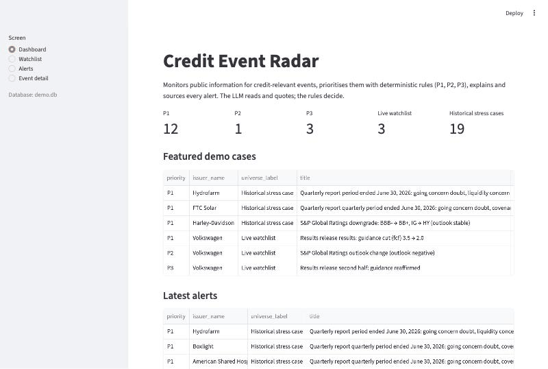
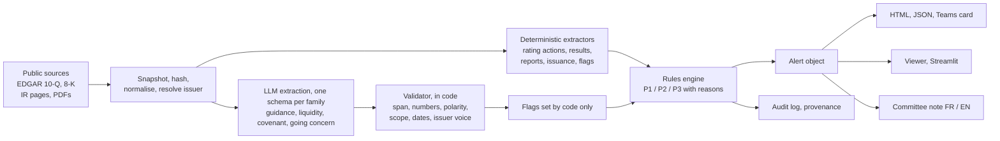
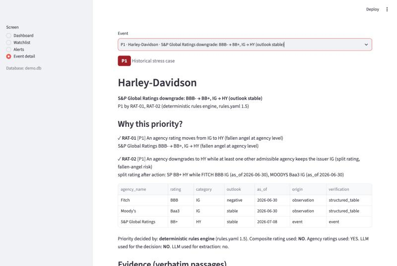
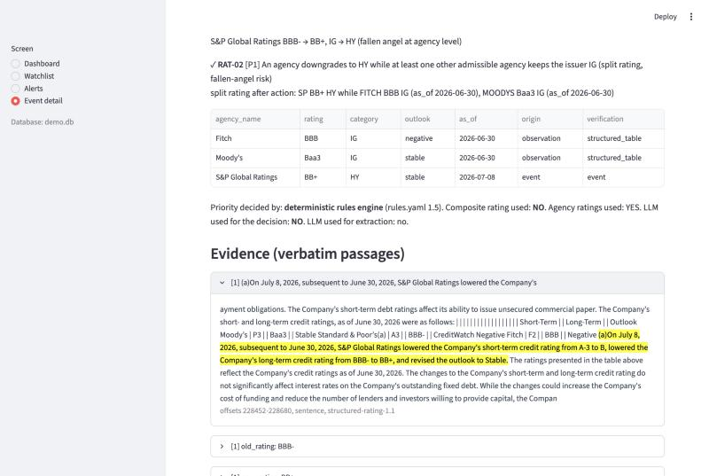
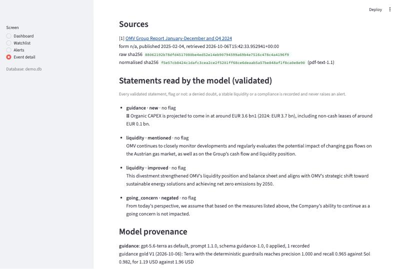
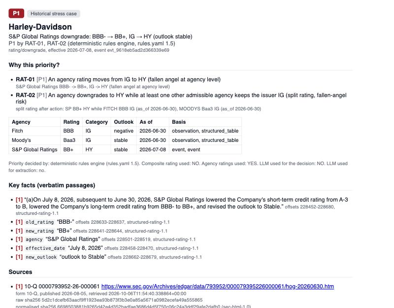

# Credit Event Radar

**Auditable AI-assisted credit monitoring.** Detect, prioritise, explain, source, alert.
The analyst decides.



An independent prototype built on public information only (SEC EDGAR filings, issuer
investor-relations pages). No affiliation with any asset manager, no investment
recommendation. Résumé en français plus bas.

## What it does

- Watches a bond issuer watchlist for credit events: rating actions, results and
  periodic reports, new issuance.
- Prioritises each event P1, P2 or P3 with a deterministic rules engine
  (`config/rules.yaml`), from agency-level ratings; the composite rating is never a
  decision input.
- Explains every priority rule by rule, with the rating state at the decision date (no
  look-ahead) and the exact passage of the source document, located by character offsets
  and tied to the hash of the bytes retrieved.
- Uses language models where they help: reading long filings for guidance changes,
  liquidity, covenant and going concern statements. Every statement is validated by code
  against the text before a flag can follow.
- Alerts: a local HTML and JSON rendering always, a Teams Adaptive Card and an e-mail
  when configured; a committee note in French and English, complete without any model.

> LLMs never assign P1, P2 or P3. They extract candidate facts. Deterministic validation
> and credit rules make the final decision.

## Architecture



Decisions are recorded as ADRs in [docs/ARCHITECTURE.md](docs/ARCHITECTURE.md); the
specification is [docs/SPEC.md](docs/SPEC.md).

## Demo

Four public cases, one behaviour each, scripted minute by minute in
[docs/DEMO.md](docs/DEMO.md):

| Case | Behaviour shown |
|---|---|
| Harley-Davidson, 10-Q, July 2026 | S&P BBB- to BB+: fallen angel, split rating with Moody's and Fitch, P1 by RAT-01 and RAT-02, decided without any model |
| Hydrofarm, 10-Q, August 2026 | Stated going concern doubt: deterministic flag, model statements validated against the text, P1 by ERN-01 |
| OMV, Q4 2024 report | "ability to continue as a going concern is not impacted": read as a denial by both passes, recorded, no alert |
| Volkswagen, H1 2025 results | A guidance cut on a live watchlist issuer, read by the model, validated, P1 by ERN-02 |









## Why this priority?

What the analyst sees on the Harley case, from `radar show-event <id> --explain`:

```
FINAL PRIORITY: P1
Event: HARLEY_DAVIDSON_INC rating/downgrade effective 2026-07-08
Rules version: 1.5

Triggered
RAT-01  TRUE  [P1]   S&P Global Ratings BBB- -> BB+, IG -> HY (fallen angel at agency level)
RAT-02  TRUE  [P1]   split rating after action: SP BB+ HY while FITCH BBB IG, MOODYS Baa3 IG

Rating state at 2026-07-08 (after action)
Moody's   Baa3  IG   as_of 2026-06-30 (stated by the source), 8 days, 10-Q ratings table
Fitch     BBB   IG   as_of 2026-06-30 (stated by the source), 8 days, 10-Q ratings table

Decision provenance
Detected by: deterministic extractor (structured, structured-rating-1.1)
Agency ratings used: YES   Composite rating used: NO   LLM used: NO
Priority decided by: deterministic rules engine (rules.yaml 1.5)

Evidence
[new_rating] 228641-228644: BB+   (https://www.sec.gov/Archives/edgar/data/793952/... raw sha256 5d2c1dce...)
```

## Evaluation results

Each extraction family was benchmarked on a hand-labelled gold set frozen with hashes
before the first call, then on blind holdouts chosen from EDGAR metadata and never read
before their labels. Corrections came from the development split only; every run is kept
as evidence. Full tables and readings in [docs/BENCHMARK.md](docs/BENCHMARK.md).

| Family | Gold and holdouts | Decision level (what fires P1) |
|---|---|---|
| Guidance | 30 documents, 57 occurrences | precision 1.000, recall 0.965 with the deterministic scope guard |
| Liquidity | 20 documents, two blind holdouts of 5 | every stress case found; one false flag on a boilerplate sentence, documented |
| Covenants | 18 documents, two holdouts of 5 | Sol 4 of 4 breach cases, Terra 2 of 4; no false flag for either on the clean filings |
| Going concern | 19 documents, dev and holdout | 7 of 7 and 2 of 2 doubt cases, 0 false flags on 10 filings without a doubt |

Total model spend for the whole evaluation: about 19 USD, under a hard budget stop,
every answer cached and replayable at zero cost.

## Model routing

| Task | Default model | Rationale |
|---|---|---|
| Guidance | Terra | best cost to quality balance with the deterministic guardrails |
| Liquidity | Terra | same stress cases found as the challenger, lower cost |
| Covenants | Sol | better recall on breach cases, no observed rise in false flags, about twice the cost |
| Going concern | Terra | 7/7 dev and 2/2 holdout, 0 false flags, 1.84 USD |

Configured in `config/settings.yaml` (`llm.routing`), with the reason recorded in every
run, every stored statement and every explanation.

> LLMs never assign P1, P2 or P3. They extract candidate facts. Deterministic validation
> and credit rules make the final decision.

## Quick start

Five minutes, no API key needed: the demo database is built from the public filings kept
as fixtures and the cached model answers of the benchmark runs.

```bash
uv sync
uv run python scripts/build_demo_db.py --fresh     # fixtures, rules, cached statements, alerts, static site
uv run radar viewer --db data/demo.db               # http://localhost:8501
```

Or without a server: `open outputs/site/index.html`.

Useful commands:

```bash
uv run radar events --db data/demo.db                               # every decided event
uv run radar show-event <event_id> --explain --db data/demo.db      # Why this priority?
uv run radar alert <event_id> --db data/demo.db                     # HTML, JSON, Teams card
uv run radar note <event_id> --lang fr --no-llm --db data/demo.db   # committee note, no key
uv run pytest -q                                                    # about 1000 tests, offline
```

Live ingestion (`radar ingest`, `radar process`, `radar llm-extract --events`, `radar
llm-apply`) needs `.env`: a declared `SEC_USER_AGENT`, an `OPENAI_API_KEY` and
`LLM_RUN_BUDGET_USD`, the hard cap of one run. The optional prose of the committee note
needs `DEMO_GENERATION_BUDGET_USD`, one cap for every note. See `.env.example`.

## Project structure

```
config/       universe, rules, rating scales, model routing, pricing
src/radar/    connectors, normalise, extract, materiality (rules engine), llm, enrich,
              alerts, notes, viewer, db, cli
prompts/      versioned prompt library (extraction, notes)
eval/         labelling guides, frozen gold sets, benchmark runs kept as evidence
tests/        offline tests, public fixtures (private filing bytes are not committed)
docs/         SPEC, ARCHITECTURE (ADRs), BENCHMARK, DEMO, CASE_STUDY, ROADMAP
outputs/      alerts, notes, static site (generated, not committed)
```

## Known limitations

- Statement recall is low where it does not matter: a filing repeats a doubt or a breach
  many times, the models quote it once or twice; the decision level is unaffected.
- One known false flag (General Motors, a liquidity "risks and uncertainties" sentence)
  is kept as decided and documented, not featured.
- A covenant validator backlog is documented and deliberately not tuned after the
  holdouts: resolution words in the next sentence, future test dates in a stated breach,
  a few wordings.
- On periodic reports, liquidity and covenant flags come from validated model statements
  only; the going concern keeps a strict deterministic path.
- The seed ratings are sourced but not signed off; the composite is shown as structural
  and never used to decide.
- The French committee note quotes the English rule descriptions of `rules.yaml`.

## Further reading

- [Case study](docs/CASE_STUDY.md): problem, workflow, architecture, evaluation,
  results, failure cases, production considerations, with a French synthesis.
- [180-day roadmap](docs/ROADMAP.md): illustrative, for an institutional fixed-income
  environment, based solely on public information.
- [Benchmarks](docs/BENCHMARK.md), [architecture decisions](docs/ARCHITECTURE.md),
  [demo script](docs/DEMO.md).

## Résumé (FR)

Credit Event Radar surveille l'information publique à la recherche d'événements de crédit
sur une watchlist d'émetteurs obligataires : actions de notation, résultats et rapports
périodiques, émissions. Il les priorise en P1, P2, P3 avec un moteur de règles
déterministe, explique chaque priorité règle par règle, relie chaque fait à la phrase
exacte du document source avec son hash, et les restitue en alerte, en carte Teams et en
note de comité FR/EN. Les modèles de langage lisent et citent ; ils n'attribuent jamais une
priorité : la validation déterministe et les règles de crédit décident. Prototype
indépendant construit exclusivement à partir d'informations publiques ; aucune
recommandation d'investissement.

## Disclaimer

Independent prototype for research and demonstration. Demo universe constructed
exclusively from publicly disclosed information. The historical stress cases are public
filings of issuers outside the demo watchlist, used as controls; they are not positions
of any portfolio. Every output is a draft to be validated by an analyst. No investment
recommendation is made or implied.
